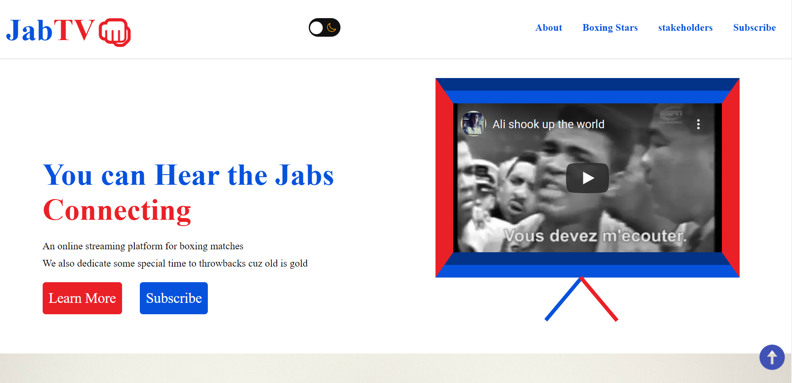

# JabTV Landing Page

A landing page website template for campers. Made with the love of boxing at heart.

## Github repo

This is the [link](https://github.com/Ksound22/JabTV-Landing-Page) to the Github repo of the project

## Tech Stack

**Client:** HTML, CSS, Vanilla JavaSCript

## Tools Used

Below are are list of tools used, and the precise things they were used for:

- [Ion Icons](https://ionic.io/ionicons) for dark theme switcher icons
- [Icon8](https://icons8.com/) for scroll-tot-top icon
- [Roboto font](https://icons8.com/) for font family
- [Favicon IO](https://favicon.io/favicon-generator/) for favicons.

## Folder Structure

The index.html and readme files are in the root folder, alongside the screenshot included in the readme.

The assets folder contains the CSS and JavaScript files, all images and icons used, in their respective folders.
